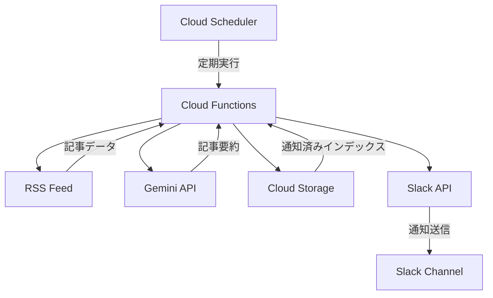
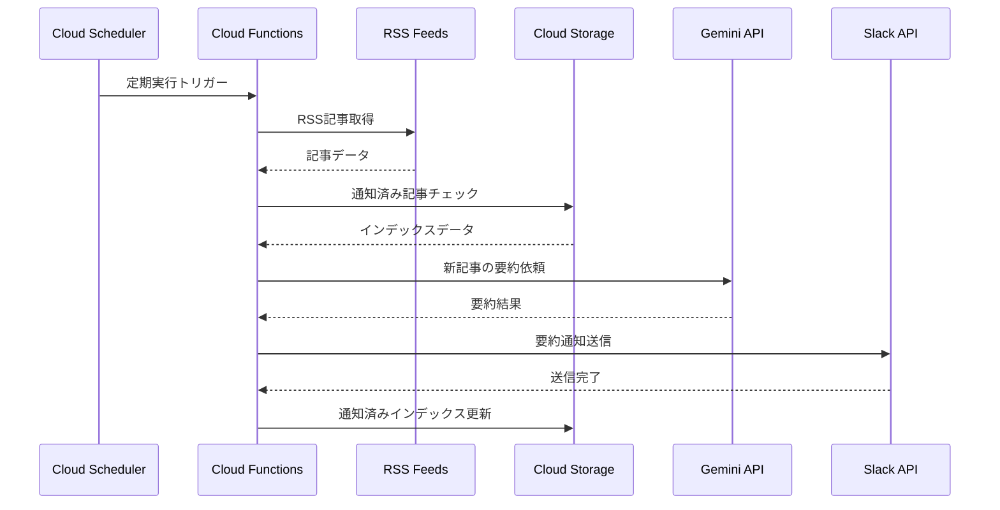
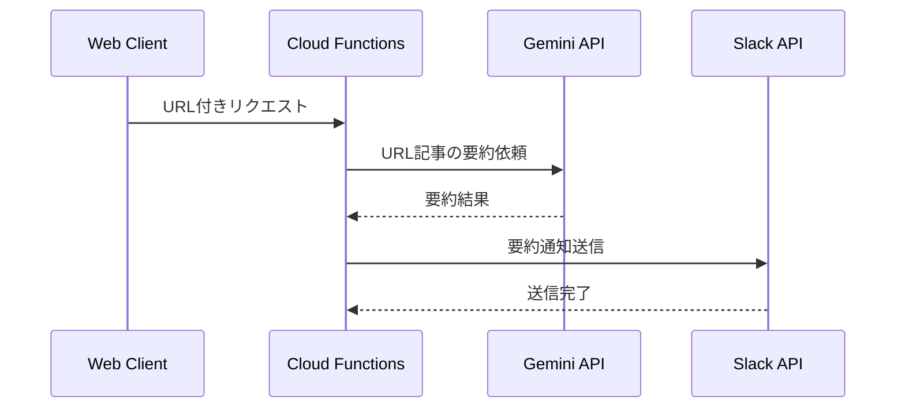

# Article Summarizer v3

Go言語による記事要約システム

## 🎯 プロジェクト概要

RSS（はてなブックマーク・Lobsters）から記事を取得し、Gemini APIで要約してSlackに通知するシステム。
Google Cloud Functions上で動作し、安定した運用を実現。

## 🚀 特徴

- **Google Cloud Functions**: サーバーレス環境での安定動作
- **RSS対応**: はてなブックマーク・Lobstersの記事を自動取得
- **記事要約**: Gemini APIによる高品質な記事要約
- **Slack通知**: 要約結果をSlackに自動送信
- **重複防止**: 通知済み記事インデックスの永続化により重複通知を防止

## 📊 システム構成図（定期実行パターン）



## 🔄 処理フロー① 定期実行パターン



## 🔄 処理フロー② Webリクエストパターン

※システム構成図は定期実行パターンとほぼ同じのため割愛



## 🛠️ 技術スタック

- **言語**: Go 1.21+
- **実行環境**: Google Cloud Functions
- **データ保存**: Cloud Storage (JSON)
- **RSS**: はてなブックマーク、Lobsters
- **記事要約**: Google Gemini API
- **通知**: Slack API

## 📁 プロジェクト構成

```
article-summarizer-v3/
├── app/                     # アプリケーションコード
│   ├── cloud_function.go    # Cloud Functions エントリーポイント
│   ├── cmd/server/          # ローカル実行用ファイル
│   ├── internal/            # 内部パッケージ
│   │   ├── application/     # アプリケーション層
│   │   ├── repository/      # データアクセス層
│   │   ├── service/         # ビジネスロジック層
│   │   └── transport/       # トランスポート層
│   ├── test/                # 統合・E2Eテスト
│   ├── go.mod
│   ├── go.sum
│   └── Makefile             # ビルド・タスク管理
└── README.md
```

## 📋 開発・デプロイ

### ローカル開発

```bash
# プロジェクトクローン
git clone https://github.com/pep299/article-summarizer-v3.git
cd article-summarizer-v3/app

# 依存関係インストール
make deps

# 開発サーバー起動
make dev

# テスト実行
make test

# デプロイ
make deploy
```

## 📄 API仕様

### エンドポイント

- `POST /process` - RSS記事の処理・要約
- `POST /webhook` - Webhook経由での記事要約